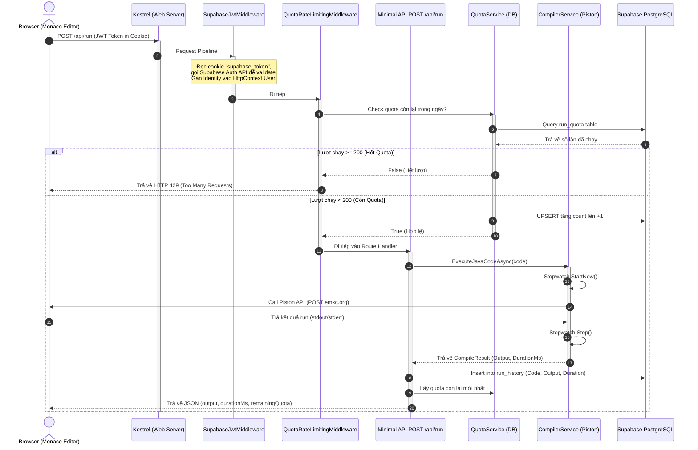
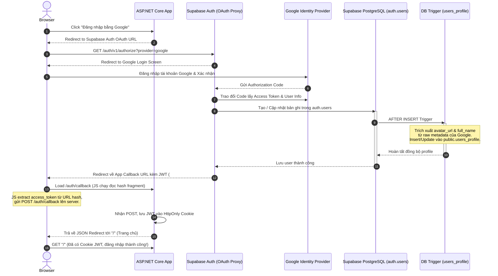

# TÀI LIỆU HỌC TẬP & HƯỚNG DẪN DỰ ÁN JAVA IDE MINI
*(Dành cho lập trình viên chuyển đổi từ hệ sinh thái Java / Spring Boot sang C# .NET lần đầu tiên)*

Chào mừng bạn đến với dự án **Java IDE Mini**. Đây là một dự án thực tế được xây dựng trên nền tảng **ASP.NET Core 8 Razor Pages** kết hợp với **Supabase (PostgreSQL & Auth)** và **Piston API Compiler Engine**. Tài liệu này được biên soạn chi tiết nhằm giúp bạn nhanh chóng nắm bắt các khái niệm tương đương của C#/.NET so với Java/Spring Boot thông qua mã nguồn thực tế.

---

## 📁 1. So Sánh Cấu Trúc Thư Mục (.NET vs Java Maven)

Cấu trúc thư mục của dự án **testVibeCode** (.NET) tương quan trực tiếp với cấu trúc quen thuộc của một dự án Spring Boot Maven như sau:

| ASP.NET Core (.NET) | Spring Boot (Java Maven) | Giải thích vai trò |
| :--- | :--- | :--- |
| `[Root Directory]/` | `[Root Directory]/` | Thư mục gốc chứa toàn bộ project. |
| `testVibeCode.csproj` | `pom.xml` | File định nghĩa project, quản lý dependencies (NuGet packages vs Maven dependencies). |
| `Program.cs` | `Application.java` | Điểm khởi chạy của ứng dụng, nơi cấu hình DI container và Middleware Pipeline (Spring Security / Filters). |
| `Pages/` | `src/main/resources/templates` | Chứa giao diện Razor Pages (.cshtml) tương đương với templates Thymeleaf/JSP. |
| `Pages/s/` | Thư mục sub-controller | Định tuyến tĩnh/động cho chức năng (ở đây là `/s/{shortId}` tương đương Spring `@RequestMapping("/s/{shortId}")`). |
| `wwwroot/` | `src/main/resources/static` | Thư mục chứa các tệp tĩnh (CSS, JS, Monaco Editor, Favicon). |
| `Data/` | `src/main/java/.../repository` | Chứa `DbContext` (EF Core) và định nghĩa các Entities kết nối database. |
| `Services/` | `src/main/java/.../service` | Chứa logic nghiệp vụ (gọi Piston API, tính toán quota). Tương đương `@Service`. |
| `Middleware/` | `src/main/java/.../filter` | Chứa các lớp chặn request HTTP (JWT Auth, Rate Limiter). Tương đương Spring `Filter` hoặc `HandlerInterceptor`. |
| `appsettings.json` | `application.properties` | File cấu hình môi trường chạy. |

---

## 🔄 2. Luồng Request End-To-End Trong ASP.NET Core

Dưới đây là sơ đồ Mermaid biểu diễn luồng đi của một yêu cầu HTTP chạy code Java từ trình duyệt lên server:



---

## 🔑 3. Luồng Google OAuth 2.0 Qua Supabase Proxy

Khi lập trình viên chọn đăng nhập bằng Google, cơ chế hoạt động diễn ra theo luồng sau:



---

## 💡 4. Giải Thích Các Điểm Khác Biệt Cốt Lõi (C# ↔ Java)

### 4.1 async/await vs CompletableFuture (Bất đồng bộ)
- **Java**: Để thực hiện bất đồng bộ không block thread chính, Spring Boot sử dụng `@Async` hoặc đối tượng `CompletableFuture.supplyAsync()`. Code dễ bị chuyển thành "Callback Hell" hoặc khó debug.
- **C#**: Sử dụng cơ chế Task-based Asynchronous Pattern (TAP) qua cặp từ khóa `async` và `await`. Bất kỳ phương thức nào trả về `Task` hoặc `Task<T>` đều có thể chờ bằng `await`. Compiler của .NET sẽ tự sinh một State Machine dưới nền để quản lý, giúp viết code bất đồng bộ mượt mà như code đồng bộ.
  ```csharp
  // C#
  public async Task<string> FetchDataAsync() {
      var result = await client.GetStringAsync(url);
      return result;
  }
  ```

### 4.2 IHttpClientFactory vs RestTemplate/OkHttp (Http Connection Pool)
- **Java**: Việc gọi API ngoài trong Spring thường dùng `RestTemplate` hoặc `WebClient`. Nếu khởi tạo mới `RestTemplate` cho mỗi request sẽ gây cạn kiệt socket. Lập trình viên phải tự cấu hình một Connection Pool (`PoolingHttpClientConnectionManager`).
- **C#**: .NET tích hợp sẵn `IHttpClientFactory`. Nó quản lý vòng đời của các `HttpMessageHandler` bên dưới, tái sử dụng các kết nối để tránh lỗi socket exhaustion, đồng thời tự động cập nhật các thay đổi DNS. Bạn chỉ cần gọi `_httpClientFactory.CreateClient()` là có kết nối an toàn.

### 4.3 DbContext vs EntityManager / JpaRepository
- **Java**: JPA/Hibernate dùng `EntityManager` để quản lý persistence context. Spring Data JPA bọc ngoài bằng `JpaRepository` interface để cung cấp các hàm CRUD.
- **C#**: Entity Framework Core (EF Core) sử dụng `DbContext`. Nó đại diện cho một phiên làm việc với database, bọc cả Unit of Work và Repository pattern. Bạn định nghĩa các thuộc tính `DbSet<T>` tương đương với các Repository. Thay đổi dữ liệu chỉ cần gọi `SaveChanges()` hoặc `SaveChangesAsync()` để commit một transaction tự động.

### 4.4 Middleware Pipeline vs Filter Chain
- **Java**: Spring Security và Spring MVC xử lý HTTP request qua một chuỗi các `Filter` (Filter Chain) chạy trước khi request đến Controller.
- **C#**: ASP.NET Core sử dụng một Pipeline các Middleware. Mỗi Middleware nhận vào một delegate `RequestDelegate` trỏ tới phần tử tiếp theo. Middleware có thể thay đổi request/response hoặc ngắt luồng (short-circuit) không cho request đi tiếp bằng cách không gọi delegate `_next`.

### 4.5 C# Records vs Java Records
- **Java 14+**: `public record RunRequest(String code) {}` tạo ra lớp chứa dữ liệu bất biến, tự gen getter, equals, hashCode, toString.
- **C# 9+**: `public record RunRequest(string Code, long? SnippetId);` có tính năng tương tự. Rất hữu ích cho các DTO truyền nhận dữ liệu qua API.

### 4.6 LINQ vs Java Streams / Criteria API
- **Java**: Truy vấn nâng cao trong database yêu cầu viết SQL/JPQL thủ công hoặc dùng Criteria API rất dài dòng. Lọc bộ nhớ dùng Stream API (`stream().filter(...).collect(...)`).
- **C#**: LINQ (Language Integrated Query) được tích hợp trực tiếp vào cú pháp ngôn ngữ C#. Bạn có thể viết truy vấn database (LINQ to Entities) bằng cú pháp y hệt như truy vấn trên danh sách RAM (LINQ to Objects).
  ```csharp
  // C# (Lọc database trực tiếp qua EF Core)
  var activeSnippets = await dbContext.Snippets
      .Where(s => s.UserId == userId && s.IsPublic)
      .OrderByDescending(s => s.CreatedAt)
      .ToListAsync();
  ```

---

## 🛠️ 5. Hướng Dẫn Setup & Chạy Dự Án Local

### Bước 5.1: Chuẩn bị môi trường
1. Cài đặt **.NET 8 SDK** hoặc mới hơn.
2. Cài đặt **Git**.
3. Cài đặt IDE khuyến nghị: **Visual Studio 2022**, **JetBrains Rider**, hoặc **VS Code**.

### Bước 5.2: Khởi tạo database Supabase
Nếu bạn muốn dùng database hiện tại `ideJavaMini`:
- URL: `https://gctjxdirrmekxoxwxvmo.supabase.co`
- Anon Key: Đã được cấu hình sẵn trong file `appsettings.Development.json` (Vui lòng không commit file này lên GitHub!).

### Bước 5.3: Cấu hình database password local
1. Mở file [appsettings.Development.json](file:///c:/Users/huyza/OneDrive/M%C3%A1y%20t%C3%ADnh/testVibeCode/appsettings.Development.json).
2. Thay thế `YOUR_DATABASE_PASSWORD_HERE` bằng mật khẩu Postgres database Supabase của bạn.
   *(Mật khẩu này là mật khẩu do bạn tự tạo khi thiết lập dự án Supabase ban đầu).*

### Bước 5.4: Setup Google OAuth trên Google Cloud Console
1. Truy cập [Google Cloud Console](https://console.cloud.google.com).
2. Tạo mới một Project (hoặc chọn project có sẵn).
3. Tìm kiếm **APIs & Services** -> **OAuth consent screen**:
   - Chọn User Type: **External**.
   - Điền thông tin ứng dụng cần thiết.
4. Truy cập **Credentials** -> **Create Credentials** -> **OAuth 2.0 Client ID**:
   - Application type: **Web application**.
   - **Authorized redirect URIs** (CỰC KỲ QUAN TRỌNG):
     - Local: `http://localhost:5000/auth/callback` (hoặc cổng HTTP thực tế ứng dụng chạy local).
     - Production: `https://YOUR-APP.up.railway.app/auth/callback` (Link deploy trên Railway).
5. Bấm Create -> Copy **Client ID** và **Client Secret**.

### Bước 5.5: Cấu hình Google Provider trên Supabase
1. Mở **Supabase Dashboard** -> Đi tới project của bạn (`ideJavaMini`).
2. Chọn **Authentication** -> **Providers** -> Bật provider **Google**.
3. Dán **Client ID** và **Client Secret** vừa lấy từ Google Cloud Console vào đây.
4. Lưu cấu hình.

### Bước 5.6: Restore và Khởi chạy local
Mở terminal tại thư mục workspace và chạy các lệnh sau:

```powershell
# 1. Khôi phục các dependencies (giống mvn clean install)
dotnet restore

# 2. Khởi chạy ứng dụng (Mặc định sẽ chạy trên cổng 5000 / 5001)
dotnet run --urls="http://localhost:5000"
```

Mở trình duyệt truy cập `http://localhost:5000` để bắt đầu trải nghiệm!

---

## 🚀 6. Hướng Dẫn Deploy Lên Railway.app qua GitHub

Dự án đã được cấu hình sẵn các file để Railway tự động nhận diện và build (qua `Dockerfile` và `railway.toml`).

### Bước 6.1: Push code lên GitHub
Tạo một repository mới trên GitHub và push mã nguồn lên đó:
```bash
git init
git add .
git commit -m "feat: init java ide mini project with supabase auth and compiler"
git branch -M main
git remote add origin YOUR_GITHUB_REPO_URL
git push -u origin main
```

### Bước 6.2: Kết nối Railway
1. Đăng nhập vào [Railway.app](https://railway.app).
2. Bấm **New Project** -> Chọn **Deploy from GitHub repo**.
3. Chọn repository chứa dự án của bạn.
4. Railway sẽ tự động phát hiện file `Dockerfile` và bắt đầu quá trình build.

### Bước 6.3: Cấu hình Variables (Biến môi trường) trên Railway
Để ứng dụng có thể kết nối database và chạy xác thực ở production, bạn **BẮT BUỘC** phải cấu hình các biến môi trường sau trên dashboard của Railway (mục **Variables**):

| Tên biến môi trường (Key) | Giá trị (Value) | Giải thích |
| :--- | :--- | :--- |
| `Supabase__Url` | `https://gctjxdirrmekxoxwxvmo.supabase.co` | Địa chỉ API Supabase của bạn. |
| `Supabase__AnonKey` | `eyJhbGciOiJIUzI...` | Anon Key của Supabase dùng xác thực. |
| `ConnectionStrings__DefaultConnection` | `Host=db.gctjxdirrmekxoxwxvmo...;Password=YOUR_DB_PASSWORD;...` | Connection String đầy đủ tới Postgres của Supabase (thay mật khẩu thực tế vào). |
| `GOOGLE_CLIENT_ID` | `YOUR_GOOGLE_CLIENT_ID` | OAuth Client ID cấu hình cho production. |
| `GOOGLE_CLIENT_SECRET` | `YOUR_GOOGLE_CLIENT_SECRET` | OAuth Client Secret. |

> [!WARNING]
> **TẠI SAO KHÔNG ĐƯỢC COMMIT CHỨA KEY THẬT LÊN GITHUB?**
> - GitHub là môi trường công khai (hoặc bán công khai). Khi bạn commit các API Key nhạy cảm (như Supabase service_role key, Database Password, Google Client Secret) lên repo, các bot quét tự động sẽ phát hiện ra chỉ sau vài giây.
> - Kẻ xấu có thể dùng các key này để chiếm quyền kiểm soát database, đánh cắp thông tin người dùng, hoặc spam tốn phí tài khoản của bạn.
> - Supabase và các nhà cung cấp cloud lớn (Google, AWS) tích hợp các công cụ quét tự động. Nếu phát hiện API key bị lộ trên GitHub public, họ sẽ tự động vô hiệu hóa key đó ngay lập tức để bảo vệ tài khoản của bạn, khiến ứng dụng bị sập đột ngột.
> - Luôn lưu các key nhạy cảm này trong file `.env` hoặc `appsettings.Development.json` (được liệt kê trong `.gitignore`), và nạp qua biến môi trường (Environment Variables) của server khi chạy production.
